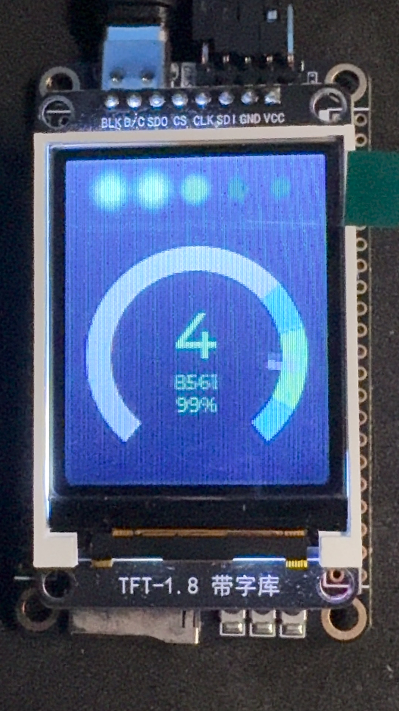
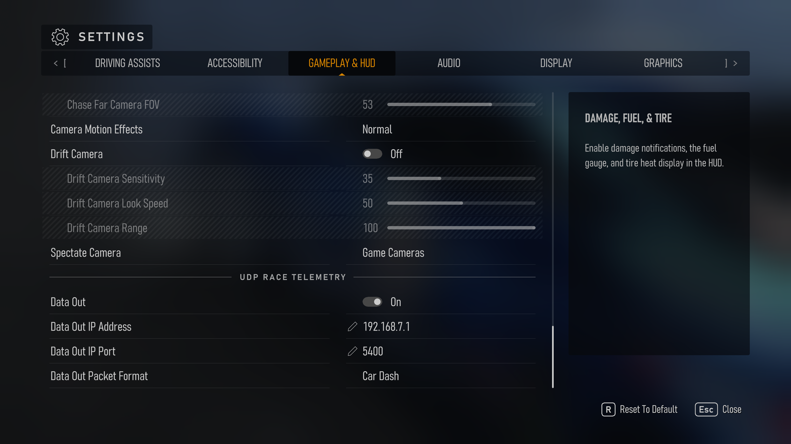
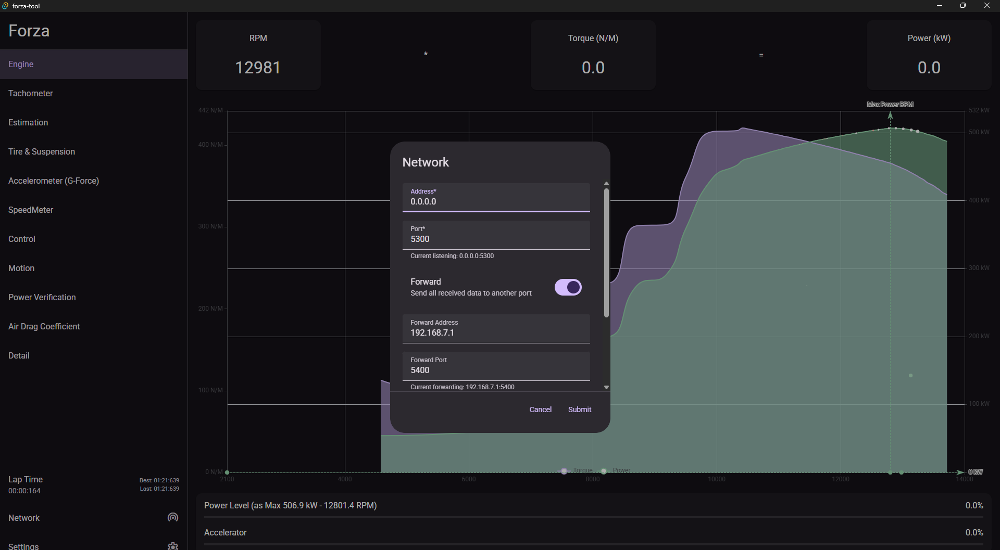

# Intro

A forza telemetry app on stm32h7. Come with real time car engine power output analysis. Support Forza Motorsport / Forza Horizon.



<video width="852" height="480" controls>
  <source src="./doc/demo.mp4" type="video/mp4">
</video>

# Game setting



* `Data Out` - On
* `Data Out IP Address` - 192.168.7.1
* `Data Out IP Port` = 5400
* `Data Out Packet Format` - Car Dash

#  Communication and Software Arch

```
Forza Game App
 |
Udp Data Packet (toward 192.168.7.1)
 |
Windows RNDIS
 |
Host USB
 |
stm32 USB
 |
tinyusb
 |
lwip
 |
Udp Data Packet (from Host) 
 |
stm32 Internal Data Analysis
 |
lvgl (render UI)
 |
st7735 (display UI)
```

# Available Feature

1. Tachometer
2. Control
3. G-Force

# Relative

My another project. Only frontend software [forza-tool](https://github.com/JohnGu9/forza-tool). You can use the [Network - Forward] feature to use both software at the same time (remember to set the listen address to 0.0.0.0).


